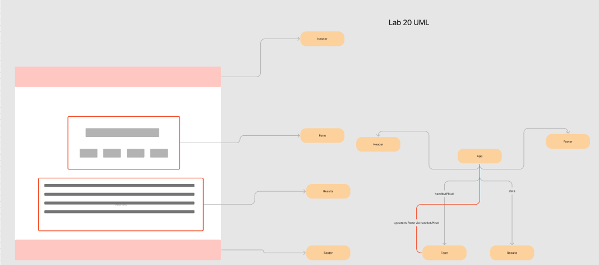

# resty

  Build an API testing tool to run in any browser - users can easily interact with APIs in a familiar interface. 

[CodeSandbox Dev Branch](https://codesandbox.io/p/github/nurselaine/resty/draft/flamboyant-kapitsa?file=%2Fsrc%2Fcomponents%2Fform%2Findex.js&selection=%5B%7B%22endColumn%22%3A15%2C%22endLineNumber%22%3A3%2C%22startColumn%22%3A15%2C%22startLineNumber%22%3A3%7D%5D) - not currently working

[Deployed Site](https://nurselaine-resty.netlify.app/)

# UML

# Phase 1
  Basic React Application
  Scaffolding 
  Basic State
  Rendering 