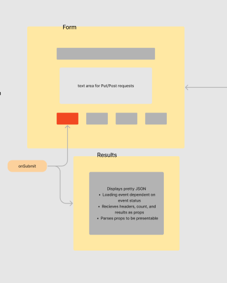

# resty

  Build an API testing tool to run in any browser - users can easily interact with APIs in a familiar interface. 

[CodeSandbox Dev Branch](https://codesandbox.io/p/github/nurselaine/resty/draft/flamboyant-kapitsa?file=%2Fsrc%2Fcomponents%2Fform%2Findex.js&selection=%5B%7B%22endColumn%22%3A15%2C%22endLineNumber%22%3A3%2C%22startColumn%22%3A15%2C%22startLineNumber%22%3A3%7D%5D) - not currently working

[Deployed Site](https://nurselaine-resty.netlify.app/)

## To run Resty
  - npm i axios react-spinners react-json-pretty and sass

# UML

 

# Phase 1
  Basic React Application
  Scaffolding 
  Basic State
  Rendering 

# Phase 2
  Implement useState hook
  Pass data from Form component to Results 
  Add styling for form and loading feedback

# Phase 3
  User enters an API URL
  Chooses a REST Method
  Clicks the “Go” button
  Application fetches data from the URL given, with the method specified
  Displays the response headers and results separately
  Both headers and results should be “pretty printed” JSON
  Use a third party component to pretty print JSON